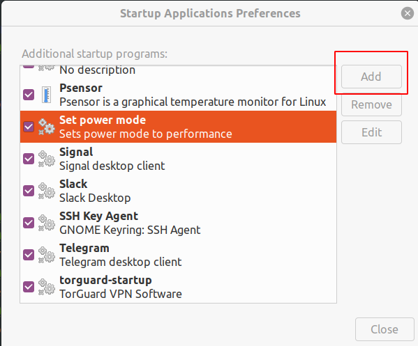

# Power mode

The purpose of this script is to set the CPU power mode. This will force the CPU to run at higher frequency.
This documentation will show how to set the script to run at startup. This is due to power mode can be set to default value on reboot/shutdown.
------------
Development enviroment environment:
- Ubuntu 20.04 64-bit
- Python version 3.8.10
- Linux kernel 5.11.0-44-generic
- IDE PyCharm 2021.3.1
------------

## Steps to take

### Download script
Download the* set_power_mode* py script and put in a folder of your choice.

### Allow sudo rights
Since this script contains a command that needs sudo permission you can either choose to add this to your sudoers file or enter password every time.
To add exception for your user start by running editor
```bash
$ sudo visudo
```
Then add following line, change "username" to your own
```bash
username ALL=NOPASSWD:/usr/bin/tee echo performance | sudo tee /sys/devices/system/cpu/cpu*/cpufreq/scaling_governor
```
Thats it, press "ctrl+x" then "y" to save and exit

### Add script to run at startup
Search for "Startup Applications Preferences" on your system.
Select "Add"
- In the "name" field, choose the name of your choice
- In the "command" field set it to
```bash
python3 path/to/sript.py
```
- In the description field, choose a description of your choice



There you go, now the script will run at startup and set power mode to performance if not already set.

------------

Special thanks to @blarsen for providing commands
